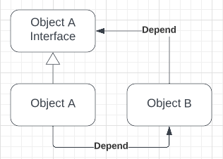
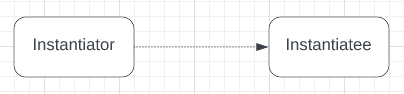
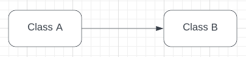
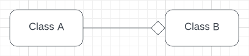
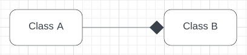

# Connected
## Background for a project
Most projects that I have done,
I haven't seen class dependency as problematic.
Now I've come more familiar with the subject, and now I want to correct this way of thinking.
I want
to study more deeply object-oriented software development how design
and implement classes with minimal number of dependencies. 
Dependencies are not always bad and with object-oriented programming,
we need to create dependencies to interact with other objects.
Still, when creating class, we need to keep in mind all dependency's and avoid unnecessary dependencies between classes.

# Project diary
## Planning
**1.2.2023**
Added Composition and aggregate UML and short explanations

**31.1.2023**
Added design patterns to readme

**30.1.2023**
Added object types

**29.1.2023**
The current plan is to get an overall overview scope of the project. 
Because this project is related to my thesis work and I have only limited time,
I need to specify scope for this project.
#### Updates
* Fill readme.md file with ideas and what project is about
* Determine project scope

# Dependencies types
## Circular dependencies
[Circular dependencies](https://en.wikipedia.org/wiki/Circular_dependency) are that object A depends on object B and another way around.
This is the same kind problem as a chicken egg dilemma.
Compiler will inform about this issue if classes are set like in picture below. 


[Mutual recursion](https://en.wikipedia.org/wiki/Mutual_recursion) is when
two functions share the same data and make recursive calculations for it,
for basic example of this can be found from Wikipedia.
``` 
bool is_even(unsigned int n) {
    if (n == 0)
        return true;
    else
        return is_odd(n - 1);
}

bool is_odd(unsigned int n) {
    if (n == 0)
        return false;
    else
        return is_even(n - 1);
}
```
For test this recursive function, we give number 4 is_odd function. 
is_odd function will pass 4-1 to is_even function.
This continues between functions until the given number is 0.
These two functions depend on each other to perform calculations.

## Cyclic dependencies
A cyclic dependency is formed when two or more abstractions have direct or indirect dependencies on each other.
Cyclic dependencies between abstractions violate the [Acyclic Dependencies Principle (ADP)](https://en.wikipedia.org/wiki/Acyclic_dependencies_principle)
and Ordering Principle.
(Girish Suryanarayana, Ganesh Samarthyam, Tushar Sharma. Refactoring for software. Desing Smells. 2014)
Cyclic dependencies between two abstractions solved using interface.



# Cmake
# Libraries static and dynamic
# C++
## Object types
According to an Ivar Jacobson objects have three different types. 
In a book, he defines entity, 
interface and control objects and those all have special purposes of object-oriented software.
* **Entity object** models information in the system that should be held for a longer time.
* **The interface object** model behavior and information that is dependent on the interface to the system.
* **The control objects** model functionality that is not naturally tied to any other object.

***Ivar Jacobson. Object-oriented software engineering. A use case driven approach. 1998.***

How can we define good objects for the program?

## Desing patterns
All well-structured object-oriented architectures are full of patterns.
Indeed, one of the ways that I measure the quality of an object-oriented system is 
to judge whether its developers have paid careful attention to the common collaborations among its objects.
Gamma Erich, Helm Richard, Johnson Ralph, Vlissides John, Desing Patterns Element of Reusable Object-Oriented Software. 2005
In foreword paragraph gang of four answering my question: How we can set objects interacting with each other?
From the definition of object types to well-structured systems in a long way to go. 
Next, we need a deep dive to a world of design patterns.

### Images for reminder:


Instantiator creating instance from Instantiatee 



Class A has reference of class B, and it's easy to change on runtime with another class that has the same type.

### Aggregation

To qualify as an Aggregation, a whole object and its parts must have the following relationship:
* The part (member) is part of the object (class)
* The part (member) can (if desired) belong to more than one object (class) at a time 
* The part (member) does not have its existence managed by the object (class)
* The part (member) does not know about the existence of the object (class)

To store multiple references in one object we need, use std::reference_wrapper.
```std::vector<std::reference_wrapper<std::string>> names{ tom, berta }; // these strings are stored by reference, not value```

UML picture of aggregation



Class B holds one or more reference/pointer to class A.
When class B is destroyed only reference and a pointer will be destroyed.

[Learn CPP](https://www.learncpp.com/cpp-tutorial/aggregation/) 2023

### Composition

To qualify as a composition, an object and a part must have the following relationship:
* The part (member) is part of the object (class)
* The part (member) can only belong to one object (class) at a time
* The part (member) has its existence managed by the object (class)
* The part (member) does not know about the existence of the object (class)

Composition is the stronger form of aggregation.
Composition can occur when a class is a collection or container of other classes,
but where the contained classes have a strong life cycle dependency on the container—essentially,
if the container is destroyed, its contents are also destroyed

UML picture of composition



Example class B creates a private instance of Class A. When class B is destroyed also class A will be destroyed.

[CppCodeTips.com](https://cppcodetips.wordpress.com/2013/12/23/uml-class-diagram-explained-with-c-samples/) 2023

[Learn CPP](https://www.learncpp.com/cpp-tutorial/composition/) 2023

### Rules and words
* ***Program to an interface, not an implementation.***
* ***Favor object composition over class inheritance.***
* Inheritance
* Composition
* Templates (Parametrized types)


