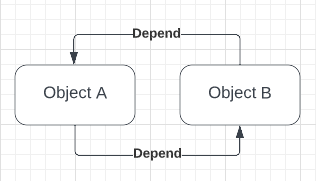

# Connected
## Background for a project
Most projects that I have done,
I haven't seen class dependency as problematic.
Now I've come more familiar with the subject, and now I want to correct this way of thinking.
I want to study architecture point of view how design and implement classes with minimal number of dependencies. 
Dependencies are not always bad and with object-oriented programming,
we need to create dependencies to interact with other objects.

# Project diary
## Planning
The current plan is to get an overall overview scope of the project. 
Because this project is related to my thesis work and I have only limited time,
I need to specify scope for this project.
## Under development
* Readme file
* Project scope
## Done

# Sources for the project
## Circular dependencies
[Circular dependencies](https://en.wikipedia.org/wiki/Circular_dependency) are that object A depends on object B and another way around.
This is the same kind problem as a chicken egg dilemma.
Compiler will inform about this issue if classes are set like in picture below. 



[Mutual recursion](https://en.wikipedia.org/wiki/Mutual_recursion) is when
two functions share the same data and make recursive calculations for it,
for basic example of this can be found from Wikipedia.
``` 
bool is_even(unsigned int n) {
    if (n == 0)
        return true;
    else
        return is_odd(n - 1);
}

bool is_odd(unsigned int n) {
    if (n == 0)
        return false;
    else
        return is_even(n - 1);
}
```
For test this recursive function, we give number 4 is_odd function. 
is_odd function will pass 4-1 to is_even function.
This continues between functions until the given number is 0.

## Cyclic dependencies
## Cmake
## Libraries static and dynamic
## C++